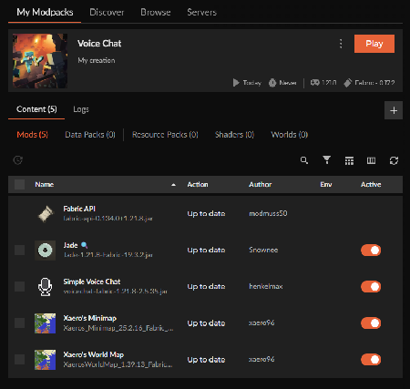

# Florabis Guidebook

## New Citizen Guide  {#new-citizen-guide}

Upon arrival in Florabis, there are a lot of things to do\!   
Here is what to do first:

1. To get to Florabis, do /ott to USERNAME
    1. Example: /ott to OldEraStory
    2. This is your One Time Teleport (OTT)
2. Place bed in apartment and set spawn
    1. Note, an apartment is given to every new citizen.
3. Join all three required discords, linked below:
    1. Florabis \- [https://discord.gg/Z8au8RGcKM](https://discord.gg/Z8au8RGcKM)
    2. Imperial Federation (IF) \- [https://discord.gg/6mXpAXHD27](https://discord.gg/6mXpAXHD27)
    3. Civ MC Discord \- [https://discord.gg/civmc-912074050086502470](https://discord.gg/civmc-912074050086502470)
4. Apply for citizenship in the state and country:
    1. Florabis (state) Discord \- \#citizenship-registration
    2. Imperial Federation (country) Discord \- \#citizenship-application
5. Complete the [basic tasks](#basic-tasks) listed on the next page to earn Tier 2
    1. Note, all citizens start as Tier 1 and complete tasks to build trust.
6. Optional, but recommended to make a bank account
    1. Note, you receive 10 diamonds once complete
    2. Join Pavia Discord \- [https://discord.gg/QJUdbdQ](https://discord.gg/QJUdbdQ)
    3. Go to [\#bank-management channel](https://discord.com/channels/523673816698978313/1095385747416170506)
    4. Create an account button
        1. Personal Account
        2. Nation: Florabis
        3. Referral Code: HS-9503
    5. The referral code gets you and the state 10 diamonds.

## Basic Tasks {#basic-tasks}

* Chop spruce and pale oak trees 🪓
    - Found at \-3210, 9190
* Plant spruce and pale oak saplings🌲
    - Found at \-3210, 9190
* Harvest potatoes 🥔
    - Large farm at \-3070, 9190
    - Smaller farms found around houses
* Harvest sweet berries 🫐
    - Smaller farms found around houses
* Collect ice 🧊
    - Use silk touch tools on lakes and rivers around Florabis
* Mining above deepslate \- Tier 1 mining area ⛏️
    - Entrance found at \-3285, 9160
    - Iron veins found at Y 15
    - Trade in ores at the ore exchange (5 ores \= 8 ingots)
* Improve New Friend Apartments
    - Customize and improve your apartment
    - Encouraged to improve each floor and decorate
* Deepslate mining \- Supervised ore finding and mining expeditions ⛏️
* Complete random tasks from the Royal Councilors 📜

## About Florabis {#about-florabis}

Welcome to El Estado Real de Florabís\!

We are a snowy state at the southern edge of Deluvia, proudly part of the Imperial Federation. Bordered by Kraftsborg to the east and Regensburg to the north, our state was once called Pristina, now reborn as Florabís. We’re building a Hispanic community that’s about amistad, creatividad, and enjoying the game together. Whether you like to build, trade, or just hang out, Florabís is for everyone.

### **Recruitment**

* Open to everyone (new, old, dual citizens, etc.)

### **Languages**

* English
* Spanish
* French

### **Citizens**

* Florabínos

### **Cities**

* Capital \= San Alejandro de Guadalupe
* Founding City \= Cuidad de Victoria
* Other Cities \=

# Structure of Florabis {#structure-of-florabis}

## Florabinos (Citizen) Tiers {#florabinos-(citizen)-tiers}

### **Non-Citizens**

* Must submit applications in the Florabis and Imperial Federation discords to become a Tier 1 Citizen

### **Tier 1 Citizen**

* New people to the state
* Rewarded with:
    - Florabis group
    - Iron armor and tools
    - New friend apartment
    - Free food from Snow Pavilion
* Progress to Tier 2 by:
    - Being active over 2-5 days
    - Assist with state projects

### **Tier 2 Citizen**

* Active and known people to the state
* Rewarded with:
    - Invited to Florachest group to access all chests in Snow Pavilion
    - Invited to  Florabuilds group to build structures
    - Given small plot of land, if available
        * May pay some diamonds to get a larger plot of land
* Progress to Tier 3 by:
    - Being active
    - Assist with state projects
    - Paying 64 diamonds to the state

### **Tier 3 Citizen**

* Loyal and active citizens
* Rewarded with:
    - Private voice channel in the discord server
    - Invited to FloraFactories for access to factories  in Snow Pavilion
    - Given medium to large plot of land, if available

## Leadership {#leadership}

### **Soberate**

* The Leader of Florabis
* Currently Cesarrr505

### **Alcalde Mayor**

* Second in Command of Florabis
* Appointed by Soberante
* Currently OldEraStory

### **Royal Councilors of Florabis**

* Managers of certain domains, appointed by Soberante
* Appointed every 6 weeks
* People interested in being a Royal Councilor must direct message the Soberante on Discord

### **Domains of the Royal Councilors**

* Defense and Security Councilor
    - Providing citizenship tiers with their armor.
    - Stock piling resources for events.
    - Hosting military training.
* Works and Infrastructure Councilor
    - Ensure builds meet the build style, approves builds, and encourages more creative / unique builds.
* Economy and Finance Councilor
    - Handles getting money deposited to the bank,
    - Decides how much money each Council member can spend
    - Manages shops
* Justice and Law Councilor
    - Ensures the law is upheld
    - Oversee court cases occur for debatable topics / crimes.
* Culture and Heritage Councilor
    - Lore telling and creation
    - Hands out Florabis flags
    - Community events
    - Creating traditions.
* Agriculture and Resources Councilor
    - Manage farms
    - Build new farms based off needs
* Mining and Natural Resources Councilor
    - Train and manage miners to dig out veins.
* Population and Settlement Councilor
    - Recruit more people
    - Ensure new people understand how Florabis works.

# Recommended Modpacks {#recommended-modpacks}

### **Fabric API by modmuss50**

* Basic structure for all mod packs

### **Jade by Snownee**

* Shows name of block in-game and what to mine it with

### **Simple Voice Chat by henkelmax**

* Talk to people in-game

### **Xaero’s Minimap and Xareo’s World Map by xaero96**

* Shows minimap on screen
* Pressing M shows big map on screen
* Turn off cave mode

### **Screenshot of Curseforge**

# Plugins {#plugins}

There are many many plugins on the server. This guidebook will have brief summaries of important features. More in-depth articles exist here:  
[https://civmc.net/wiki/](https://civmc.net/wiki/)

## Locking Doors, Chests, and Beds aka Reinforcements {#locking-doors,-chests,-and-beds-aka-reinforcements}

To lock blocks on your personal namelayer, do the following:

1. Get a stack of regular stone
2. Hold it in your hand
3. Type in /ctr
    1. This puts you in reinforcement mode
4. Left click on the block, door, chest, or bed
    1. You should see purple particles
5. Type /cto
    1. This puts you in regular playing mode

To reinforce while building, do /ctf while holding the type that you want to reinforce. Make sure to do /cto to stop reinforcing when you are done. The reinforcement hierarchy is as following:

1. Stone with 50 breaks
2. Iron with 200 breaks
3. Diamond with 2000 breaks

Do /ctinfo and click on the block to view reinforcement of the block.

## Elevators {#elevators}

Elevators are lodestones in Civ MC. They can only be made in a special factory. To use a lodestone:

1. Stand on lodestone
2. Crouch to go down
3. Jump to go up

## Transportation {#transportation}

Rail carts and horses are the main forms of transportation in this server. There are two different types of rail cart lines:

* Direct lines
    - Can hop on a railcart and go
* OneDest lines
    - Must type a command before going
    - Command to return to Florabis:
        *  /dest imperial florabis

## Snitches & Pearling {#snitches-&-pearling}

**Do not commit crimes\!** Snitches log player activity in-game and in-discord, including breaking blocks or opening chests. To set up a snitch:

* Place down a juke block (logs) or note block (no logs)
* Reinforce juke block or note block using /ctr
* Check jukebox logs using /ja

If caught doing crimes, players will pearl you. This means that:

* A player kills you with an ender pearl in the hot bar.
* You are sent to the nether and cannot escape through any portal
* You can only be freed if your pearl is freed or runs out of fuel (essence).

## Shops and Ore Exchanges {#shops-and-ore-exchanges}

How to check what the shop exchange is:

* Left click on chest or barrel
* Look at the chat for the exchange message
* Left click again to look at other exchanges in the chest or barrel

How to exchange with a shop:

* Left click to look at the exchange in the chest or barrel.
* Hold the required input items in your hand
* Left click twice on the chest or barrel

## Ores and Ore Veins {#ores-and-ore-veins}

* DO **NOT** USE FURNACES.
    - Factories can melt ores or raw metals for better return.
        * Example: 16 diamond ores to 60 diamonds
        * Example: 64 raw iron to 96 iron ingots
    - Ore exchanges can exchange ores for more ingots, but slightly worse than directly using factories.
        * Example: 16 diamond ores to 59 diamonds,
        * Example: 5 raw iron to 8 iron ingots
* Ores and ore veins spawn randomly as you dig.
    - A notification in chat will appear if you hit an ore vein.
    - Diamonds only spawn in diamond ore veins.
    - If you hit a diamond ore vein, **ONLY USE NETHRITE PICKS**
        * Netherite picks spawn up to 4 times more diamond ores.
* Additional tips
    - Mine at Y level \-35 for diamonds
    - Mine at Y level 15 for iron
    - Do not mine at bedrock

## Diamond Ore Veins {#diamond-ore-veins}

Below steps will give the most diamond ores. Read **all** steps before  starting.

* Before digging out the diamond vein:
    - Setup to not accidentally mine diamond ores
        * Do /config
        * Click the cauldron
        * Click the diamond ore
    - Setup chests to store extra blocks
        * Do not burn any blocks
* Digging out the vein **ONLY USE NETHRITE PICKS**
    - Dig out 5 blocks from the ore in each direction (X, Y, Z)
    - If you do not hit any ores, then dig 11 blocks in each direction.
    - Do not place blocks
* Collecting Diamond Ores
    - Only use silktouch
    - Collect and smelt ores at the end
    - 16 diamond ores can be melted into 60 diamonds

## Factories {#factories}

There are a lot of factories that help cut costs and create items that cannot be found in the world. However, factories have a setup cost and require repairs over time.

How to check what factories you can make:  
/fm

How to check if an item can be made or used in factories:  
/item name  
/item sand

List of all factories:  
[https://civwiki.org/wiki/Factories\_(CivMC)](https://civwiki.org/wiki/Factories_\(CivMC\))

## Miscellaneous {#miscellaneous}

* XP can only be obtained through crafting emeralds or XP bottles
* The nether can be accessed by entering through a set nether portal or by  being pearled. Creating your own portal does not work.
* There is no access to the end dimension.
* Biomes affect crop growth. Check growth rate using /rb
* Fishing can give out player heads.

# Additional Resources {#additional-resources}

## Civ MC Server Information {#civ-mc-server-information}

Server Overview \- [https://civmc.net/wiki](https://civmc.net/wiki)  
New Player Guide \- [https://civmc.net/wiki/new-player-guide](https://civmc.net/wiki/new-player-guide)

## Civ MC Player Wiki {#civ-mc-player-wiki}

General \- [https://civwiki.org/wiki/Portal:CivMC](https://civwiki.org/wiki/Portal:CivMC)  
Factories \- [https://civwiki.org/wiki/Factories\_(CivMC)](https://civwiki.org/wiki/Factories_\(CivMC\))

## Civ MC Map {#civ-mc-map}

[https://map.civinfo.net/](https://map.civinfo.net/)
